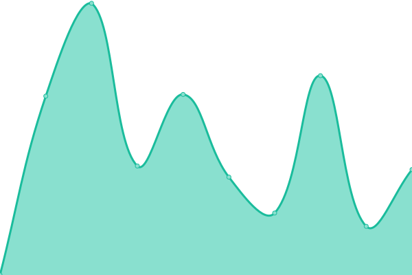
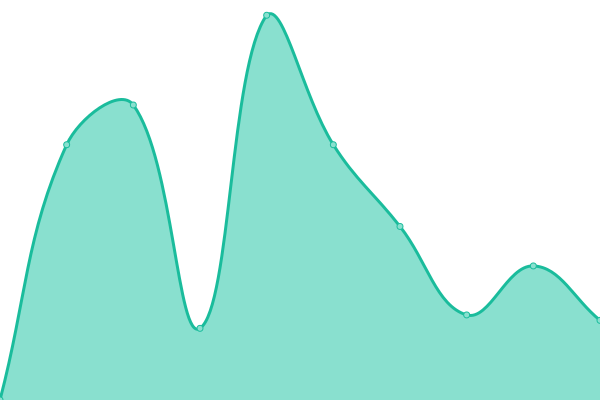
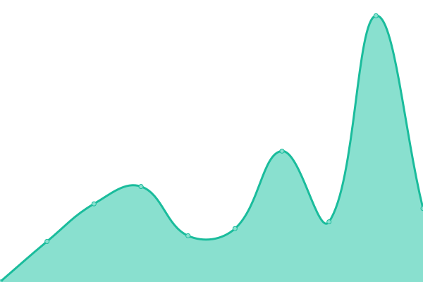
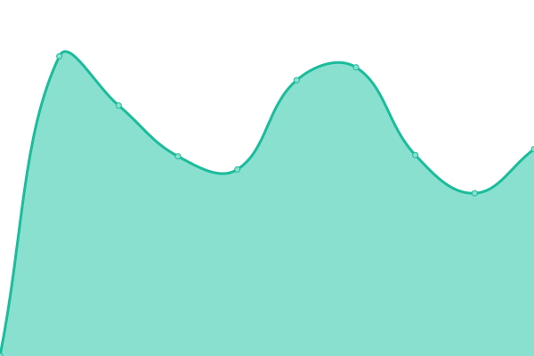
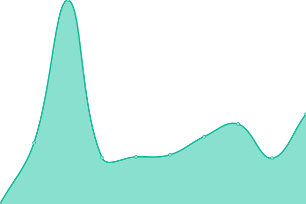

# [📈 Live Status](https://CBMDF.github.io/upptime): <!--live status--> **🟧 Partial outage**

This repository contains the open-source uptime monitor and status page for [CBMDF](www.cbm.df.gov.br), powered by [Upptime](https://github.com/upptime/upptime).

With [Upptime](https://upptime.js.org), you can get your own unlimited and free uptime monitor and status page, powered entirely by a GitHub repository. We use [Issues](https://github.com/CBMDF/upptime/issues) as incident reports, [Actions](https://github.com/CBMDF/upptime/actions) as uptime monitors, and [Pages](https://CBMDF.github.io/upptime) for the status page.

<!--start: status pages-->
<!-- This summary is generated by Upptime (https://github.com/upptime/upptime) -->
<!-- Do not edit this manually, your changes will be overwritten -->

| URL                                                      | Status  | History                                                                                            | Response Time                                                                         | Uptime                                                                                                                                                                                                                     |
| -------------------------------------------------------- | ------- | -------------------------------------------------------------------------------------------------- | ------------------------------------------------------------------------------------- | -------------------------------------------------------------------------------------------------------------------------------------------------------------------------------------------------------------------------- |
| [Poprtal CBMDF](https://www.cbm.df.gov.br)               | 🟩 Up   | [poprtal-cbmdf.yml](https://github.com/CBMDF/upptime/commits/master/history/poprtal-cbmdf.yml)     |  5059ms   |      |
| [Sistemas CBMDF](https://sistemas.cbm.df.gov.br)         | 🟩 Up   | [sistemas-cbmdf.yml](https://github.com/CBMDF/upptime/commits/master/history/sistemas-cbmdf.yml)   |  3252ms  |    |
| [Web Mail](https://webmail.cbm.df.gov.br)                | 🟩 Up   | [web-mail.yml](https://github.com/CBMDF/upptime/commits/master/history/web-mail.yml)               |  3829ms        |                |
| [SEI! GDF](https://sei.df.gov.br)                        | 🟥 Down | [sei-gdf.yml](https://github.com/CBMDF/upptime/commits/master/history/sei-gdf.yml)                 |  0ms            |                   |
| [Escalador](https://escalador.cbm.df.gov.br)             | 🟥 Down | [escalador.yml](https://github.com/CBMDF/upptime/commits/master/history/escalador.yml)             |  0ms          |               |
| [SEIOP](https://seiop.cbm.df.gov.br)                     | 🟩 Up   | [seiop.yml](https://github.com/CBMDF/upptime/commits/master/history/seiop.yml)                     |  2105ms           |                      |
| [COVID-19](https://covid.cbm.df.gov.br/)                 | 🟩 Up   | [covid-19.yml](https://github.com/CBMDF/upptime/commits/master/history/covid-19.yml)               |  1201ms        |                |
| [Teleconferência](https://teleconferencia.cbm.df.gov.br) | 🟩 Up   | [teleconferencia.yml](https://github.com/CBMDF/upptime/commits/master/history/teleconferencia.yml) |  1227ms |  |

<!--end: status pages-->

[**Visit our status website →**](https://CBMDF.github.io/upptime)

## 📄 License

- Powered by: [Upptime](https://github.com/upptime/upptime)
- Code: [MIT](./LICENSE) © [CBMDF](www.cbm.df.gov.br)
- Data in the `./history` directory: [Open Database License](https://opendatacommons.org/licenses/odbl/1-0/)
