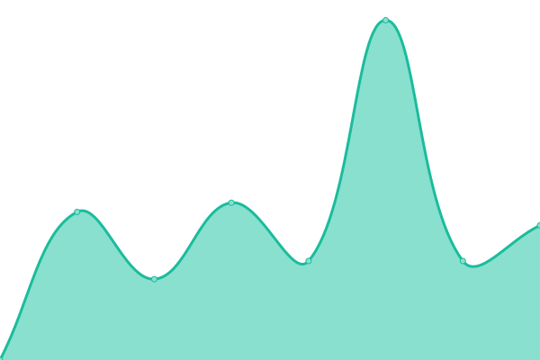

# [📈 Live Status](https://CBMDF.github.io/upptime): <!--live status--> **🟧 Partial outage**

This repository contains the open-source uptime monitor and status page for [CBMDF](www.cbm.df.gov.br), powered by [Upptime](https://github.com/upptime/upptime).

With [Upptime](https://upptime.js.org), you can get your own unlimited and free uptime monitor and status page, powered entirely by a GitHub repository. We use [Issues](https://github.com/CBMDF/upptime/issues) as incident reports, [Actions](https://github.com/CBMDF/upptime/actions) as uptime monitors, and [Pages](https://CBMDF.github.io/upptime) for the status page.

<!--start: status pages-->
<!-- This summary is generated by Upptime (https://github.com/upptime/upptime) -->
<!-- Do not edit this manually, your changes will be overwritten -->
<!-- prettier-ignore -->
| URL | Status | History | Response Time | Uptime |
| --- | ------ | ------- | ------------- | ------ |
|  [Portal CBMDF](https://www.cbm.df.gov.br) | Ativo | [portal-cbmdf.yml](https://github.com/CBMDF/upptime/commits/master/history/portal-cbmdf.yml) | 

 5473ms
     
 | 

<a href="https://CBMDF.github.io/upptime/history/portal-cbmdf">100.00%</a>
    

|  [Sistemas CBMDF](https://sistemas.cbm.df.gov.br) | Ativo | [sistemas-cbmdf.yml](https://github.com/CBMDF/upptime/commits/master/history/sistemas-cbmdf.yml) | 

 1632ms
     
 | 

<a href="https://CBMDF.github.io/upptime/history/sistemas-cbmdf">100.00%</a>
    

|  [Web Mail](https://webmail.cbm.df.gov.br) | Ativo | [web-mail.yml](https://github.com/CBMDF/upptime/commits/master/history/web-mail.yml) | 

 1319ms
     
 | 

<a href="https://CBMDF.github.io/upptime/history/web-mail">100.00%</a>
    

|  [Escalador](https://escalador.cbm.df.gov.br) | Ativo | [escalador.yml](https://github.com/CBMDF/upptime/commits/master/history/escalador.yml) | 

 1350ms
     
 | 

<a href="https://CBMDF.github.io/upptime/history/escalador">100.00%</a>
    

|  [SEIOP](https://seiop.cbm.df.gov.br) | Ativo | [seiop.yml](https://github.com/CBMDF/upptime/commits/master/history/seiop.yml) | 

 1726ms
     
 | 

<a href="https://CBMDF.github.io/upptime/history/seiop">100.00%</a>
    

|  [COVID-19](https://covid.cbm.df.gov.br) | Ativo | [covid-19.yml](https://github.com/CBMDF/upptime/commits/master/history/covid-19.yml) | 

 1228ms
     
 | 

<a href="https://CBMDF.github.io/upptime/history/covid-19">100.00%</a>
    

|  [Teleconferencia](https://teleconferencia.cbm.df.gov.br) | Ativo | [teleconferencia.yml](https://github.com/CBMDF/upptime/commits/master/history/teleconferencia.yml) | 

 1557ms
     
 | 

<a href="https://CBMDF.github.io/upptime/history/teleconferencia">100.00%</a>
    

|  [Inova](https://singular.cbm.df.gov.br/inova/) | Indisponível | [inova.yml](https://github.com/CBMDF/upptime/commits/master/history/inova.yml) | 

 0ms
     
 | 

<a href="https://CBMDF.github.io/upptime/history/inova">100.00%</a>
    

<!--end: status pages-->

[**Visit our status website →**](https://CBMDF.github.io/upptime)

## 📄 License

- Powered by: [Upptime](https://github.com/upptime/upptime)
- Code: [MIT](./LICENSE) © [CBMDF](www.cbm.df.gov.br)
- Data in the `./history` directory: [Open Database License](https://opendatacommons.org/licenses/odbl/1-0/)
